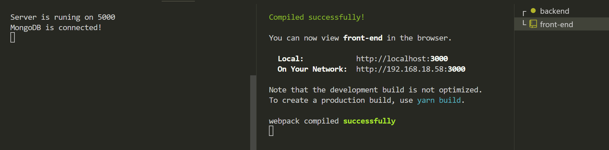

# Marketo - MERN STACK ECOMMERE WEBSITE with (React Strap & Redux Tookit with RTK Query)


## Description
This project fully fledged ecommerce-site made using MERN Stack Technologoy , with file uploading all `CRUD` operation on `User` , `Product` and `Product Category` with `CART` functionality

### FRONT END SCRIPTS 
```
cd font-end
yarn
yarn start
```
starts the developement server on port `3000`
Open [http://localhost:3000](http://localhost:3000) to view it in your browser.


### BACKE END SCRIPTS 
```
cd backend
yarn
yarn dev
```
starts the developement server on port `5000`

Runs the app in the development mode.\
Open [http://localhost:5000/api](http://localhost:5000/api/) test api in `POST MAN` or `Thunder Client`



### Reach me!
Join me on [LinkedIn](https://www.linkedin.com/in/m-adnan-mushtaq/)
Email me on `madnanmushtaq000@gmail.com`
If you found  it helpful make sure to give it a `Star`
**Note: If you found any bugs Kindly reach me out, make a pull request, I am always looking for to learn and make somthing that matters!**
